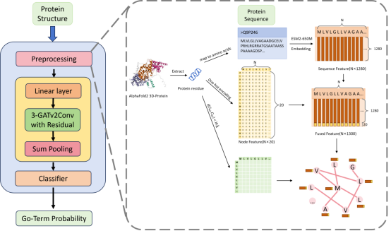

# UniRES-GO

## 1. Environment Setup

| Package | Version |
|---------|---------|
| Python | 3.11.13 |
| dgl | 2.4.0+cu124 |
| numpy | 2.0.1 |
| pandas | 2.3.1 |
| scipy | 1.16.0 |
| torch | 2.4.1+cu124 |
| torch-geometric | 2.6.1 |
| torchaudio | 2.4.1+cu124 |
| torchvision | 0.19.1+cu124 |

## 2. Data Download


- **Protein function labels:** [UniProtKB search (taxonomy_id:9606, reviewed)](https://www.uniprot.org/uniprotkb?query=%28taxonomy_id%3A9606%29&facets=reviewed%3Atrue)
  - Download the TSV file and select the GO term IDs
  
- **Protein structure data:** [AlphaFold Protein Structure Database](https://alphafold.com/download)
  - Download human protein PDBs (similar to the `data/filtered_pdb` folder contents, I gave 5 pdb files as an example, you can delete them)
  - The example uses v4; there may be newer releases now
  - create `data/pdb` folder, save the dataset to pdb folder(In short, the pdb file contains over 20,000 pdb files.)
> **Note:** this dataset is big, may over 6g;
## 3. Data Processing

### 3.1 Navigate to data processing directory
```bash
cd data_processing
```

### 3.2 Filter PDB files
```bash
python filtered_pdb.py
```

### 3.3 Generate structural graphs
```bash
python get_struct_graph.py
```
> **Note:** This creates the `struct_data_v2` folder under `data`, this dataset is very big, may over 40g;

**Example output:**
```
[19713/20265] Processing protein: Q9P232 (new file #5833)
../data/filtered_pbd/AF-Q9P232-F1-model_v4.pdb:MMFPWKQLILLSFIGCLGGELLLQGPVFIKEPSNSIFPVGSEDKKITLHCEARGNPSPHYRWQLNGSDIDMSMEHRYKLNGGNLVVINPNRNWDTGTYQCFATNSLGTIVSREAKLQFAYLENFKTKMRSTVSVREGQGVVLLCGPPPHSGELSYAWIFNEYPSFVEEDSRRFVSQETGHLYISKVEPSDVGNYTCVVTSMVTNARVLGSPTPLVLRSDGVMGEYEPKIEVQFPETLPAAKGSTVKLECFALGNPIPQINWRRSDGLPFSSKIKLRKFSGVLEIPNFQQEDAGSYECIAENSRGKNVARGRLTYYAKPHWVQLIKDVEIAVEDSLYWECRASGKPKPSYRWLKNGAALVLEERTQIENGALTISNLSVTDSGMFQCIAENKHGLVYSSAELKVVASAPDFSKNPMKKLVQVQVGSLVSLDCKPRASPRALSSWKKGDVSVQEHERISLLNDGGLKIANVTKADAGTYTCMAENQFGKANGTTHLVVTEPTRITLAPSNMDVSVGESVILPCQVQHDPLLDIIFTWYFNGALADFKKDGSHFEKVGGSSSGDLMIRNIQLKHSGKYVCMVQTGVDSVSSAADLIVRGSPGPPENVKVDEITDTTAQLSWKEGKDNHSPVISYSIQARTPFSVGWQTVTTVPEVIDGKTHTATVVELNPWVEYEFRVVASNKIGGGEPSLPSEKVRTEEAVPEVPPSEVNGGGGSRSELVITWDPVPEELQNGEGFGYVVAFRPLGVTTWIQTVVTSPDTPRYVFRNESIVPYSPYEVKVGVYNNKGEGPFSPVTTVFSAEEEPTVAPSQVSANSLSSSEIEVSWNTIPWKLSNGHLLGYEVRYWNGGGKEESSSKMKVAGNETSARLRGLKSNLAYYTAVRAYNSAGAGPFSATVNVTTKKTPPSQPPGNVVWNATDTKVLLNWEQVKAMENESEVTGYKVFYRTSSQNNVQVLNTNKTSAELVLPIKEDYIIEVKATTDGGDGTSSEQIRIPRITSMDARGSTSAISNVHPMSSYMPIVLFLIVYVLW
Extracted 1028 residues, sequence length: 1028
Adjusted to 1028 residues
One-hot features shape: torch.Size([1028, 20])
ESM features shape: torch.Size([1028, 1280])
Combined features shape: torch.Size([1028, 1300])
...
Total files: 20265
Skipped files: xxx
Newly processed files: xxx
Current total processed: 20235
```

### 3.4 Process labels
```bash
python labels_load.py
```

### 3.5 Split data
```bash
python divided_data.py
```

## 4. Train the UniRES-GO Model

> **Important:** Set `labels_num` according to the output of `labels_load.py`

```bash
cd ..
python train.py --mode hyperparameter --branch mf --labels_num 324
python train.py --mode hyperparameter --branch cc --labels_num 281
python train.py --mode hyperparameter --branch bp --labels_num 656
```

## 5. Ablation Study

Multiple model variants are available to try:

```bash
python ablation_study.py --branch mf --labels_num 324
python ablation_study.py --branch cc --labels_num 281
python ablation_study.py --branch bp --labels_num 656
```